<div align="center">

# 🌐 Laboratorio 1 — Redes

### Esquemas de comunicación e introducción a Wireshark

[](#)
[](#)
[](https://www.wireshark.org/)
[](#estado-del-laboratorio)

**Universidad del Valle de Guatemala**  
Facultad de Ingeniería · Departamento de Ciencias de la Computación

</div>

---

## Descripción

Este repositorio documenta el **Laboratorio 1 del curso CC3067 Redes**. La práctica estudia la comunicación desde dos perspectivas complementarias:

1. **Comunicación humana controlada:** codificación Morse y Baudot, transmisión empaquetada y conmutación de mensajes.
2. **Análisis de redes:** instalación, personalización y configuración de capturas en Wireshark.

La actividad muestra que toda comunicación necesita reglas compartidas para representar datos, delimitar mensajes, identificar origen y destino, administrar esperas, confirmar entregas y recuperarse de errores.

> [!IMPORTANT]
> Este README documenta los incisos **3.1 al 3.6**. El análisis HTTP se completó con una captura real realizada desde la interfaz Wi‑Fi; las respuestas reportadas provienen directamente de los encabezados observados en Wireshark.

---

## 👥 Integrantes

| Participante | Carné | Función principal |
|---|:---:|---|
| **Pablo Daniel Barillas Moreno** | **22193** | Pareja responsable · Cliente 1 · Informe individual |
| **Rafael Andres Chivalan** | **21534** | Pareja responsable · Conmutador |
| **Renato Rojas** | --- | Pareja colaboradora · Cliente 2 |
| **Melisa Mendizabal** | --- | Pareja colaboradora · Cliente 3 |

---

## Resultados principales

| Indicador | Resultado | Interpretación |
|---|:---:|---|
| Error con código Morse | **2.56 %** | 2 errores en 78 letras transmitidas |
| Error con código Baudot | **7.69 %** | 6 errores en 78 letras transmitidas |
| Mensajes conmutados | **3 de 3** | Todos recibieron confirmación `ACK` |
| Paquetes SYN encontrados | **4 de 651** | Aproximadamente 0.61 % de la traza |
| Tamaño por archivo de captura | **5 MB** | Rotación automática mediante búfer circular |
| Archivos conservados | **10** | Se mantuvieron únicamente los diez más recientes |
| Versión HTTP del navegador | **HTTP/1.1** | Visible en la solicitud `GET` |
| Versión HTTP del servidor | **HTTP/1.1** | Visible en la respuesta `200 OK` |
| Contenido devuelto | **81 bytes** | Valor del encabezado `Content-Length` |

### Hallazgo general

El código **Morse** resultó más sencillo y confiable para los participantes. Baudot ofreció bloques fijos de cinco bits, pero exigió mayor precisión para conservar la agrupación correcta. En Wireshark, la misma necesidad de precisión se observó en los campos, filtros y reglas utilizados para interpretar cada paquete.

---

### Documentos preparados

- 📘 [Reporte grupal — incisos 3.1 a 3.3](Laboratorio-1_Esquemas-de-comunicacion_RDC_Sec-10/Primera-parte_Esquemas-de-comunicación/Reporte/Reporte_Grupal_Laboratorio_1_Redes.pdf)
- 📗 [Informe individual completo — incisos 3.4 a 3.6](Laboratorio-1_Esquemas-de-comunicacion_RDC_Sec-10/Segunda-parte_Introducción-a-Wireshark/reporte/Informe_Individual_Laboratorio_1_Incisos_3_4_a_3_6_Pablo_Barillas.pdf)

---

# Primera parte — Esquemas de comunicación

## 3.1 📡 Transmisión directa de códigos

Se transmitieron los mismos seis mensajes mediante **Morse** y **Baudot ITA2**, de manera que ambos métodos pudieran compararse bajo condiciones equivalentes. Los espacios no se contabilizaron para calcular la tasa de error.

### Protocolo Morse

- Un pulso corto representó un punto `.`.
- Un pulso largo representó una raya `-`.
- Se utilizaron pausas diferentes para separar componentes, letras y palabras.
- El emisor anunció el inicio y el final de cada transmisión.
- El receptor anotó los símbolos y reconstruyó el mensaje.

### Protocolo Baudot

- Cada carácter fue representado por **cinco bits** en modo letras de ITA2.
- Los bits se pronunciaron como “cero” y “uno”.
- Se realizó una pausa después de cada grupo de cinco bits.
- Si un bloque quedaba incompleto, se solicitaba repetir únicamente ese carácter.

### Registro de errores

| Emisor | Mensaje | Letras | Morse | Baudot |
|---|---|:---:|:---:|:---:|
| Pablo | `REDES CONECTAN` | 13 | 0 | 1 |
| Pablo | `MENSAJE LISTO` | 12 | 1 | 0 |
| Pablo | `DATOS SEGUROS` | 12 | 0 | 2 |
| Rafael | `ENVIO CORRECTO` | 13 | 0 | 1 |
| Rafael | `CODIGO DIGITAL` | 13 | 1 | 0 |
| Rafael | `PAQUETE RECIBIDO` | 15 | 0 | 2 |
| **Total** | **6 mensajes** | **78** | **2** | **6** |

### Ejemplo de representación

Mensaje original:

```text
REDES CONECTAN
```

Código Morse:

```text
.-. . -.. . ... / -.-. --- -. . -.-. - .- -.
```

Baudot ITA2:

```text
01010 00001 01001 00001 00101 00100 01110 11000 01100 00001 01110 10000 00011 01100
```

Las conversiones completas de los seis mensajes se encuentran en el **reporte grupal**.

---

## 3.2 Transmisión empaquetada

Para representar un mensaje como una unidad completa se utilizaron **notas de voz de WhatsApp** codificadas en Morse. En lugar de transmitir y corregir en tiempo real, el emisor primero grababa el contenido y luego enviaba el archivo completo.

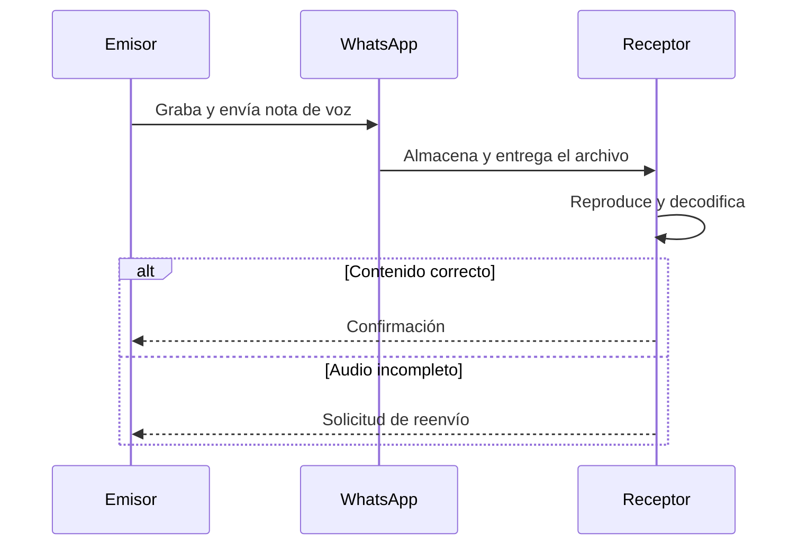

### Resultados

| Emisor | Mensaje | Reproducciones | Resultado |
|---|---|:---:|---|
| Pablo | `NODO PRINCIPAL` | 1 | Correcto |
| Pablo | `ENLACE SEGURO` | 2 | Correcto después de repetir el audio |
| Pablo | `TRAMA RECIBIDA` | 1 | Correcto |
| Rafael | `CANAL ABIERTO` | 1 | Correcto |
| Rafael | `RUTA CONFIRMADA` | 2 | Correcto después de repetir el audio |
| Rafael | `DATOS COMPLETOS` | 2 + reenvío | Primera grabación incompleta |

### Dificultades observadas

- No existía retroalimentación inmediata mientras se realizaba la grabación.
- El ruido y la compresión podían volver ambiguos algunos pulsos.
- Era necesario comprobar que el inicio y el final no quedaran recortados.
- Si el archivo estaba incompleto, debía retransmitirse la nota completa.
- La entrega dependía de la carga, transmisión y descarga del archivo.

La actividad representó propiedades similares a las de un paquete: **encapsulación, almacenamiento, entrega, retraso, confirmación y retransmisión**.

---

## 3.3 Conmutación de mensajes

Se agregó un conmutador central para recibir, ordenar y reenviar las notas de voz. Los clientes ya no enviaban directamente al destinatario: toda comunicación pasaba primero por el conmutador.

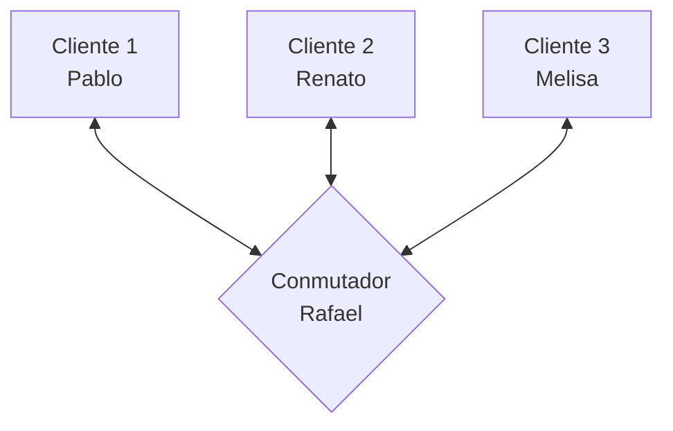

### Formato del encabezado

```text
ID: M01 | ORIGEN: C1 | DESTINO: C3 | LONGITUD: 18
```

### Protocolo acordado

1. El cliente enviaba `SOLICITUD C1 → C3`.
2. El conmutador respondía `LISTO C1` o `ESPERA C1 – POSICION 1`.
3. El cliente enviaba el encabezado y la nota únicamente después de recibir `LISTO`.
4. El conmutador confirmaba la entrada mediante `RECIBIDO M01`.
5. El mensaje era reenviado según el campo `DESTINO`.
6. El receptor respondía `ACK M01` si el contenido era correcto.
7. El emisor recibía la notificación `ENTREGADO M01`.
8. Sin `ACK` durante un minuto, el mensaje se reenviaba una vez.

### Mensajes procesados

| ID | Origen | Destino | Contenido | Estado |
|---|---|---|---|---|
| `M01` | C1 · Pablo | C3 · Melisa | `SERVIDOR DISPONIBLE` | Entrega inmediata; ACK recibido |
| `M02` | C2 · Renato | C1 · Pablo | `MENSAJE ENTREGADO` | Esperó en cola; ACK recibido |
| `M03` | C3 · Melisa | C2 · Renato | `CONEXION CONFIRMADA` | Esperó en cola; ACK recibido |

### Posibilidades introducidas

- Direccionamiento mediante encabezados.
- Cola FIFO para evitar transmisiones superpuestas.
- Confirmación de recepción mediante `ACK`.
- Retransmisión ante ausencia de confirmación.
- Registro de origen, destino, orden y estado.
- Posibilidad futura de agregar prioridades y permisos.

### Más conmutadores

| Ventajas | Desventajas |
|---|---|
| Mayor capacidad de procesamiento | Mayor complejidad de coordinación |
| Más clientes y rutas alternativas | Posibles duplicados o ciclos |
| Distribución de carga | Riesgo de entrega fuera de orden |
| Menor dependencia de un único dispositivo | Más configuración y mantenimiento |

---

# Segunda parte — Introducción a Wireshark

## Requisitos

- Microsoft Windows.
- Wireshark **4.6.7**.
- Npcap instalado junto con Wireshark.
- Archivo `intro-wireshark-trace1.pcap`.
- Permisos para capturar tráfico en la interfaz física.

---

## 3.4 Personalización del entorno

Se creó el perfil **Pablo Barillas** y se abrió la traza proporcionada, la cual contiene **651 paquetes**.

### Configuración realizada

| Elemento | Configuración |
|---|---|
| Perfil | `Pablo Barillas` |
| Formato de tiempo | `Time of Day` |
| Columna personalizada | `Longitud TCP` |
| Campo de la columna | `tcp.len` |
| Columna predeterminada `Length` | Oculta |
| Diseño | Distribución de paneles no predeterminada |
| Regla de color | `tcp.flags.syn == 1` |
| Color elegido | Naranja |
| Botón de filtro | `TCP SYN` |
| Interfaces virtuales | Ocultas |

### Interpretación de `tcp.len`

`tcp.len` muestra la cantidad de datos transportados dentro del segmento TCP:

- **1448:** segmento con 1448 bytes de carga útil.
- **198:** segmento con 198 bytes de carga útil.
- **0:** segmento TCP de control sin datos, como un `SYN` o un `ACK`.
- **Celda vacía:** el paquete no contiene TCP, por ejemplo STP o ICMPv6.

<p align="center">
  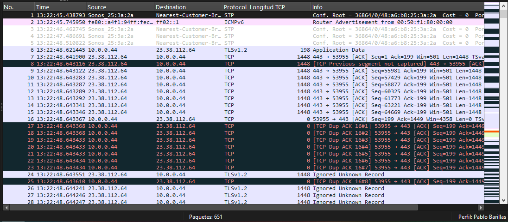
</p>

### Filtro TCP SYN

```text
tcp.flags.syn == 1
```

La condición encontró **4 paquetes de 651**, resaltados en naranja. Estos segmentos participan en el establecimiento de conexiones TCP y muestran longitud TCP igual a cero porque no transportan datos de aplicación.

<p align="center">
  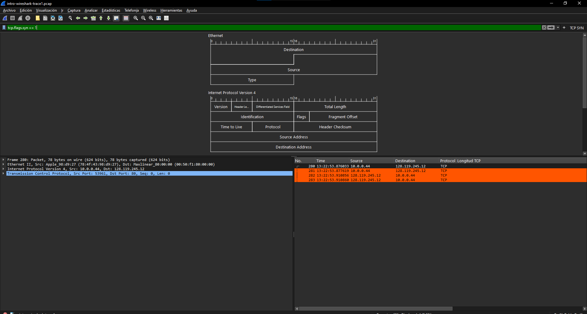
</p>

### Interfaces ocultadas

- WAN Miniport.
- Microsoft Wi‑Fi Direct Virtual Adapter.
- Adapter for loopback traffic capture.
- Kaspersky VPN.
- USBPcap.

Las interfaces físicas **Wi‑Fi** y **Ethernet** permanecieron visibles. Wi‑Fi fue seleccionada por mostrar actividad.

---

## 3.5 Captura con búfer circular

### Revisión de red

Se ejecutó:

```powershell
ipconfig /all
```

La salida permitió identificar:

- Interfaz activa: `Intel(R) Wi‑Fi 6 AX201 160MHz`.
- DHCP habilitado.
- Red privada `192.168.0.0/24`.
- Máscara `255.255.255.0`.
- Puerta de enlace y servidor DHCP `192.168.0.1`.
- Adaptadores virtuales o desconectados que no debían utilizarse.

### Configuración de captura

| Parámetro | Valor |
|---|---|
| Interfaz | Wi‑Fi física |
| Formato | `pcapng` |
| Nombre base | `lab1_22193.pcapng` |
| Compresión | Ninguna |
| Rotación | Después de **5 MB** |
| Búfer circular | Activado |
| Máximo | **10 archivos** |

> [!NOTE]
> La guía utiliza la extensión `.pgcap`, pero Wireshark trabaja con las extensiones válidas `.pcap` y `.pcapng`. Para esta captura se seleccionó `pcapng`.

<p align="center">
  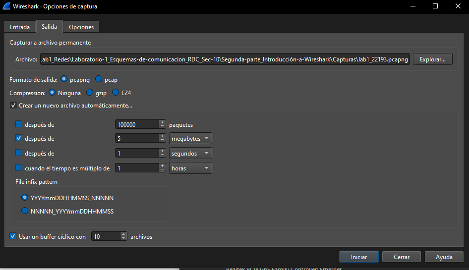
</p>

### Resultado

Se generaron suficientes paquetes para activar la rotación. La carpeta terminó con diez archivos numerados del `00007` al `00016`:

- Los archivos cerrados tienen tamaños cercanos a **4.88 MB**.
- El último archivo es menor porque la captura se detuvo antes de alcanzar el siguiente límite.
- Los archivos iniciales ya no aparecen porque el búfer conserva solamente los diez más recientes.

<p align="center">
  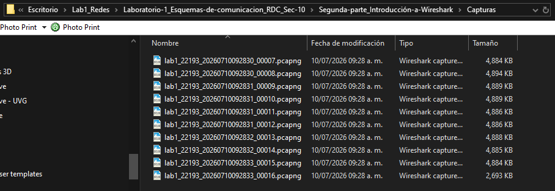
</p>

---

## 3.6 Análisis de paquetes HTTP

Se inició una captura sin filtro en la interfaz Wi‑Fi y se accedió a:

```text
http://gaia.cs.umass.edu/wireshark-labs/INTRO-wireshark-file1.html
```

Después de cargar la página se detuvo la captura y se aplicaron los filtros de visualización:

```text
http
```

```text
http.request || http.response
```

Ambas expresiones dejaron visibles cuatro mensajes HTTP: la solicitud `GET` del documento, la respuesta `200 OK`, una solicitud automática del icono `favicon.ico` y una respuesta `301 Moved Permanently` para ese recurso secundario.

<p align="center">
  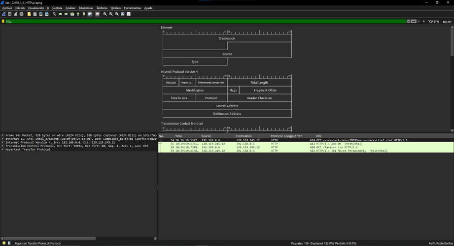
</p>

### Intercambio principal

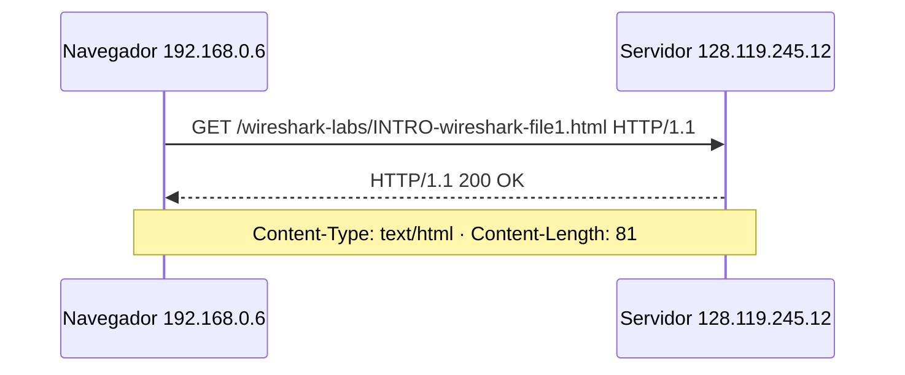

### Respuestas obtenidas

| Pregunta | Evidencia observada | Respuesta |
|---|---|---|
| Versión utilizada por el navegador | Línea de solicitud `GET ... HTTP/1.1` | **HTTP/1.1** |
| Versión utilizada por el servidor | Línea de estado `HTTP/1.1 200 OK` | **HTTP/1.1** |
| Lenguajes aceptados | Encabezado `Accept-Language` | **`es-419,es;q=0.9`** |
| Bytes de contenido devueltos | `Content-Length: 81` y `File Data: 81 bytes` | **81 bytes** |

`es-419` indica español de Latinoamérica y el valor `es;q=0.9` indica que el español genérico también es aceptado con una preferencia relativa de 0.9.

<p align="center">
  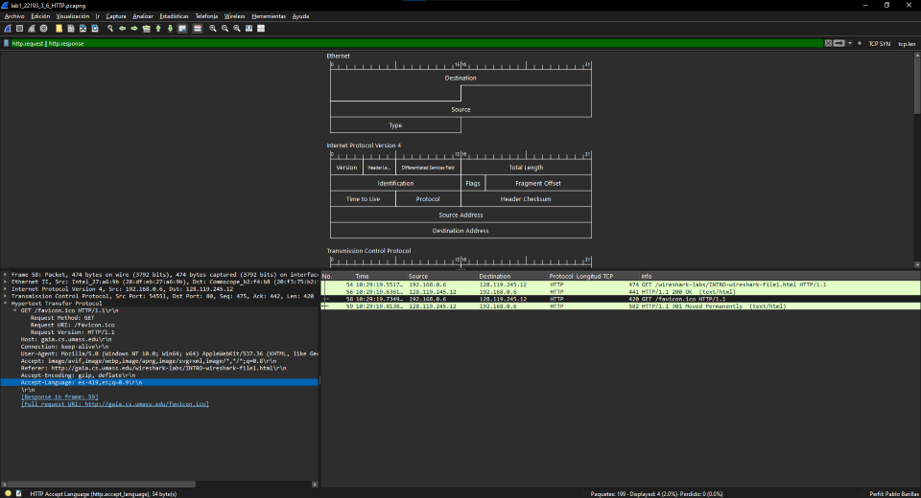
</p>

<p align="center">
  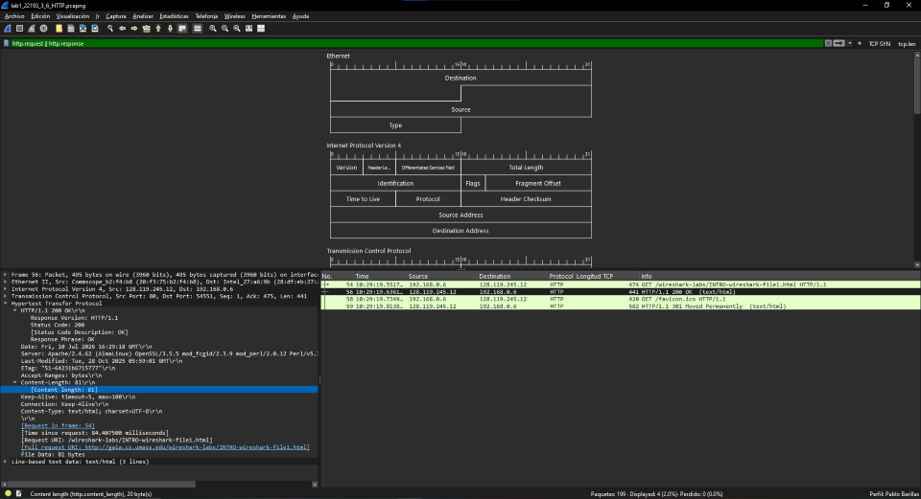
</p>

### Análisis de rendimiento y puntos de captura

Ante una descarga lenta conviene capturar paquetes en más de un punto para poder comparar tiempos y localizar el tramo problemático:

1. **Equipo cliente:** permite medir resolución DNS, establecimiento TCP, envío del `GET`, llegada de la respuesta y posibles retransmisiones.
2. **Puerta de enlace, router o firewall:** ayuda a detectar pérdida, colas, latencia, traducción NAT o políticas de seguridad.
3. **Enlace de acceso o equipo intermedio administrable:** mediante un puerto espejo `SPAN` o un TAP se puede observar el tráfico sin depender de un solo extremo.
4. **Servidor:** permite comprobar cuándo llegó la solicitud y cuándo comenzó a salir la respuesta.

Instalar la interfaz gráfica completa de Wireshark en un servidor de producción **no siempre es conveniente**. Requiere privilegios elevados, puede consumir recursos y una captura podría contener información sensible. Cuando es necesario observar el servidor, es preferible usar `dumpcap`, `tshark` o `tcpdump`, limitar la duración y el tamaño de la captura y analizar posteriormente el archivo en una estación de trabajo. La comparación entre las capturas del cliente y del servidor permite determinar si el retraso pertenece a la aplicación, al sistema operativo o a la red.

### Evidencias adicionales

<p align="center">
  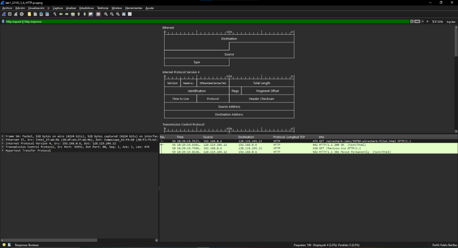
</p>

<p align="center">
  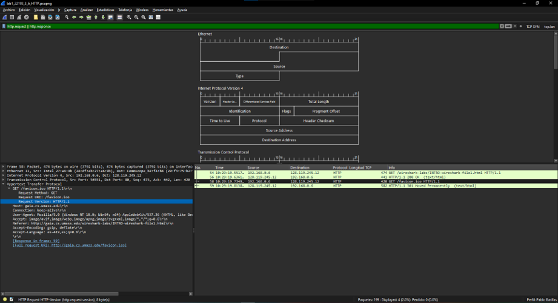
</p>

<p align="center">
  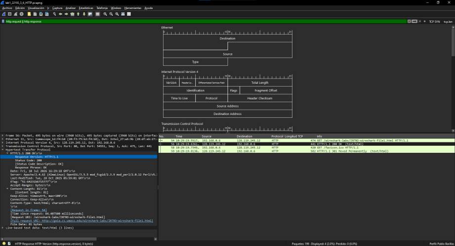
</p>

> [!NOTE]
> La solicitud de `favicon.ico` fue generada automáticamente por el navegador después de cargar el documento. No debe confundirse con la solicitud principal de `INTRO-wireshark-file1.html`; la respuesta `200 OK` y los 81 bytes corresponden al documento solicitado.

---

## Aprendizajes

- Un código compartido no es suficiente: también se necesitan delimitación y sincronización.
- Los mensajes empaquetados pueden almacenarse y retransmitirse, pero introducen espera.
- Un conmutador aporta direccionamiento y orden, aunque puede convertirse en cuello de botella.
- Los filtros de visualización no modifican la captura; únicamente cambian los paquetes mostrados.
- `tcp.len` no representa el tamaño total de la trama, sino la carga útil TCP.
- La selección correcta de la interfaz determina qué tráfico puede observarse.
- Un búfer circular controla el uso de almacenamiento durante capturas prolongadas.
- Los encabezados HTTP permiten conocer la versión del protocolo, preferencias del cliente y tamaño del contenido.
- Comparar capturas en el cliente y el servidor ayuda a separar demoras de aplicación, sistema operativo y red.

---

## Referencias

1. Universidad del Valle de Guatemala. *Laboratorio 1 — Esquemas de comunicación e introducción a Wireshark*. CC3067 Redes, 2026.
2. [Wireshark User’s Guide](https://www.wireshark.org/docs/wsug_html_chunked/).
3. [Wireshark Display Filter Reference — TCP](https://www.wireshark.org/docs/dfref/t/tcp.html).
4. [Microsoft Learn — ipconfig](https://learn.microsoft.com/windows-server/administration/windows-commands/ipconfig).
5. International Telecommunication Union. *Recommendation ITU-R M.1677-1: International Morse code*.
6. International Telecommunication Union. *Recommendation ITU-T S.1: International Telegraph Alphabet No. 2*.
7. [Kurose y Ross — Wireshark Labs](https://gaia.cs.umass.edu/kurose_ross/wireshark.php).

---

<div align="center">

**Pablo Daniel Barillas Moreno · Carné 22193**  

CC3067 Redes · Universidad del Valle de Guatemala · 2026

</div>